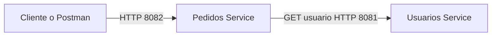

# Tarea 02 Arquitectura Orientada a Microservicios

Ejemplo académico con dos aplicaciones Spring Boot independientes. `pedidos-service` valida el usuario de cada pedido consultando por HTTP a `usuarios-service`.

## Arquitectura



Cada servicio mantiene sus datos en memoria para concentrar el ejercicio en la separación y comunicación REST. Al reiniciar las aplicaciones, los pedidos creados se borran.

## Requisitos

- Java 17
- Maven 3.9 o superior
- Postman opcional

## Ejecución

Abra dos terminales desde la carpeta raíz.

Terminal 1:

```bash
cd usuarios-service
mvn spring-boot:run
```

Terminal 2:

```bash
cd pedidos-service
mvn spring-boot:run
```

## Prueba rápida

```bash
curl http://localhost:8081/usuarios/1

curl -X POST http://localhost:8082/pedidos \
  -H "Content-Type: application/json" \
  -d '{"producto":"Teclado mecánico","valor":180000,"usuarioId":1}'

curl http://localhost:8082/pedidos
```

También puede importar `postman/Microservicios.postman_collection.json` en Postman.

## Endpoints

| Método | URL | Función |
|---|---|---|
| GET | `http://localhost:8081/usuarios` | Lista usuarios |
| GET | `http://localhost:8081/usuarios/{id}` | Consulta un usuario |
| POST | `http://localhost:8081/usuarios` | Crea un usuario |
| GET | `http://localhost:8082/pedidos` | Lista pedidos |
| POST | `http://localhost:8082/pedidos` | Crea un pedido y consulta al usuario |

## Pruebas automatizadas

Desde la raíz:

```bash
mvn test
```

## Publicación en GitHub

1. Cree un repositorio vacío en GitHub.
2. Ejecute `git init`, `git add .` y `git commit -m "Tarea microservicios"`.
3. Agregue la URL remota indicada por GitHub y ejecute `git push -u origin main`.
4. Pegue la URL pública del repositorio en el PDF antes de entregar.
